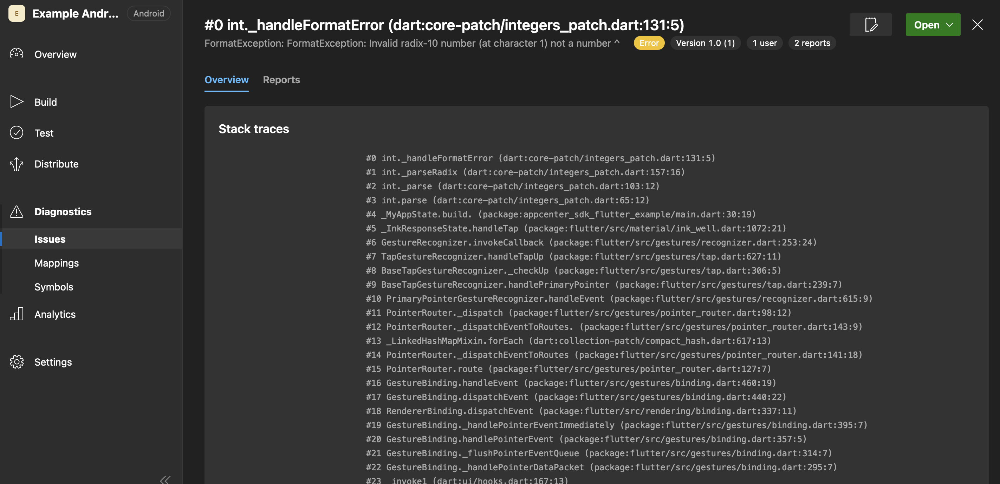
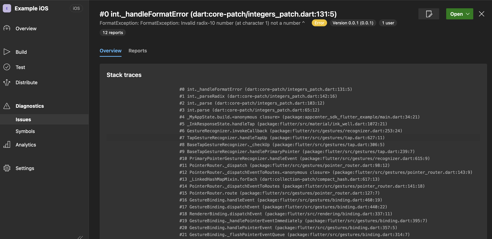

# App Center SDK for Flutter
[![madeby: zoocityboy][madeby_badge]][madeby_link]
[![License: MIT][license_badge]][license_link]
[![style: ZOO Lints][zoo_lints_badge]][zoo_lints_link]
![Flutter][flutter_badge]
![Kotlin][kotlin_badge]
![Swift][swift_badge]


This package supports only the **Analytics**, **Crashes** and **Distribute** parts of the sdk.

## Usage

```dart
import 'package:appcenter/appcenter.dart';
import 'package:flutter/material.dart';

Future<void> main() async {
  WidgetsFlutterBinding.ensureInitialized();
  await AppCenter.start(secret: '<APP-SECRET>');
  FlutterError.onError = (final details) async {
    await AppCenterCrashes.trackException(
      message: details.exception.toString(),
      type: details.exception.runtimeType,
      stackTrace: details.stack,
    );
  };
  runApp(const MyApp());
}

class MyApp extends StatefulWidget {
  const MyApp({super.key});

  @override
  State<MyApp> createState() => _MyAppState();
}

class _MyAppState extends State<MyApp> {
  @override
  Widget build(final BuildContext context) => MaterialApp(
        home: Scaffold(
          appBar: AppBar(
            title: const Text('App Center Sdk'),
          ),
          body: Center(
            child: ElevatedButton(
              onPressed: () {
                int.parse('not a number');
              },
              child: const Text('TrackException'),
            ),
          ),
        ),
      );
}
```

### AppCenter

```dart
await AppCenter.start('secret');
await AppCenter.enable();
await AppCenter.disable();
final isEnabled = await AppCenter.isEnabled();
final isConfigured = await AppCenter.isConfigured();
final installId = await AppCenter.getInstallId();
final isRunningInAppCenterTestCloud = await AppCenter.isRunningInAppCenterTestCloud();
```

### AppCenter Analytics

```dart
  await AppCenterAnalytics.trackEvent(name: 'A Event', properties: {'property':'value'}, flags: 1);
  await AppCenterAnalytics.pause();
  await AppCenterAnalytics.resume();
  await AppCenterAnalytics.enable();
  await AppCenterAnalytics.disable();
  final isEnabled = await AppCenterAnalytics.isEnabled();
  await AppCenterAnalytics.enableManualSessionTracker();
  await AppCenterAnalytics.startSession();
  final isSetted =  AppCenterAnalytics.setTransmissionInterval(3);
```

### AppCenter Crashes

```dart
  await generateTestCrash();
  final hasReceivedMemoryWarningInLastSession = AppCenterCrashes.hasReceivedMemoryWarningInLastSession();
  final hasCrashedInLastSession = AppCenterCrashes.hasCrashedInLastSession();
  await AppCenterCrashes.enable();
  await AppCenterCrashes.disable();
  final isEnabled = AppCenterCrashes.isEnabled();
  await AppCenterCrashes.trackException(message: 'MessageException', type: MessageException.runtimeType, stackTrace: StackTrace.fromString('stackTraceString'), properties: {'property':'value'});
```

When using the `trackException`, the flutter stack trace will appear in App Center.

|Android|iOS|
| - | - |
|||

## Pigeon

Since I always forget the command, I noted it here.
```bash
dart run pigeon \
  --input pigeons/messages.dart \
  --dart_out lib/src/messages.g.dart \
  --swift_out ios/Classes/Messages.g.swift \
  --kotlin_out android/src/main/kotlin/zoo/cityboy/appcenter/Messages.g.kt \
  --kotlin_package "zoo.cityboy.appcenter"
```
[coverage_badge]: https://img.shields.io/badge/coverage-100-3EB489.svg?style=flat-square
[madeby_badge]: https://img.shields.io/badge/made_by-ZOOCITYBOY-blue?style=flat-square
[madeby_link]: https://github.com/zoocityboy
[zoo_lints_badge]: https://img.shields.io/badge/lints-ZOO-3EB489.svg?style=flat-square
[zoo_lints_link]: https://pub.dev/packages/zoo_lints
[license_badge]: https://img.shields.io/badge/license-MIT-blue.svg?style=flat-square
[license_link]: https://opensource.org/licenses/EIT
[flutter_badge]:https://img.shields.io/badge/Flutter-%2302569B.svg?style=flat-square&logo=Flutter&logoColor=white
[kotlin_badge]:https://img.shields.io/badge/kotlin-%237F52FF.svg?style=flat-square&logo=kotlin&logoColor=white
[swift_badge]:https://img.shields.io/badge/swift-F54A2A?style=flat-square&logo=swift&logoColor=white